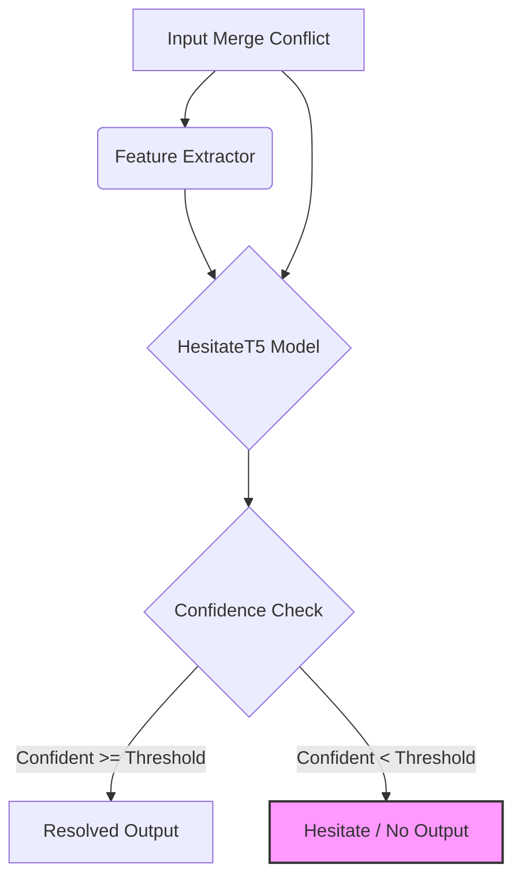
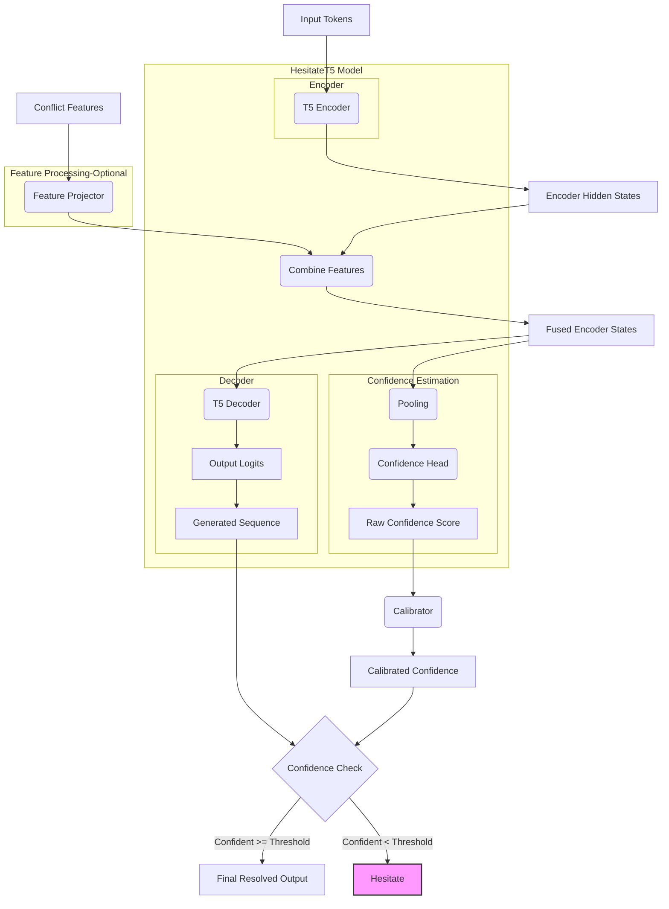

# merge-hesitate: Git Merge Conflict Resolution with Confidence

`merge-hesitate` is a tool designed to automatically resolve Git merge conflicts using a Transformer-based sequence-to-sequence model (based on T5). It incorporates a confidence estimation mechanism, allowing the model to "hesitate" and abstain from providing a resolution if its confidence is below a calibrated threshold. It also supports incorporating auxiliary features related to the conflict structure.

## Features

*   **T5-based Resolution:** Leverages a pre-trained T5 model (e.g., CodeT5) fine-tuned for the merge conflict resolution task.
*   **Confidence Estimation:** Includes a dedicated head to predict the likelihood that the generated resolution is correct.
*   **Hesitation Mechanism:** Only outputs a resolution if the predicted confidence exceeds a dynamically determined threshold.
*   **Confidence Calibration:** Employs calibration techniques (Temperature Scaling or Isotonic Regression) to ensure confidence scores better reflect true correctness probabilities.
*   **Optional Feature Fusion:** Allows integrating pre-computed features about the conflict (e.g., similarity metrics, length ratios) into the model for potentially improved performance.

## Architecture Overview

**High-Level Workflow:**



**Detailed Model Architecture:**



*(Note: Feature processing and fusion only occur if `use_features` is enabled during training and inference.)*

## Requirements

*   Python 3.7+
*   PyTorch
*   Transformers (`transformers`)
*   Accelerate (`accelerate`) for multi-GPU training
*   NumPy (`numpy`)
*   Scikit-learn (`scikit-learn`) for Isotonic Regression
*   tqdm (`tqdm`) for progress bars
*   `git` command-line tool (required for preprocessing)
*   `git-lfs` (if handling large model files/checkpoints)

Install Python dependencies:
```bash
pip install torch transformers accelerate numpy scikit-learn tqdm
```
Ensure `git` and `git-lfs` are installed on your system.

## Data Preparation

1.  **Raw Data Format:**
    Your raw data should be in a JSON file containing four lists of strings: base versions, "ours" versions, "theirs" versions, and the corresponding resolved versions.
    Example `raw_data.json`:
    ```json
    [
      ["base code 1", "base code 2", ...],
      ["ours code 1", "ours code 2", ...],
      ["theirs code 1", "theirs code 2", ...],
      ["resolved code 1", "resolved code 2", ...]
    ]
    ```

2.  **Split Data:**
    Split the raw data into training, validation, and testing sets using `scripts/split_dataset.py`.
    ```bash
    python scripts/split_dataset.py \
        --data_path path/to/your/raw_data.json \
        --output_dir RAW_DATA/split
    ```
    This will create `train.json`, `val.json`, and `test.json` in the `RAW_DATA/split` directory (by default).

3.  **Preprocess Data:**
    Tokenize the data, generate the conflict markers using `git merge-file`, format inputs/outputs, and save them in a format suitable for training. This step requires the `git` command to be available.
    ```bash
    # Ensure the split files (train.json, etc.) exist in RAW_DATA/split
    python scripts/preprocess_dataset.py
    ```
    This script will:
    *   Create temporary files/directories in `GIT_MERGE_FILES/`.
    *   Create intermediate processed chunks in `PROCESSED/`.
    *   Create the final preprocessed files (`processed_train.pkl`, `processed_val.pkl`, `processed_test.pkl`) in `PREPROCESSED/`. These `.pkl` files contain tokenized and padded input/output IDs.

## Training

Use `merge_hesitate/train.py` to train the model. It leverages `accelerate` for easy multi-GPU/distributed training.

**Example Training Command (without features):**

```bash
# For single GPU / CPU
python -m merge_hesitate.train \
    --output_dir ./training_output \
    --model_name_or_path ./codet5-small \
    --tokenizer_name_or_path ./tokenizer \
    --batch_size 16 \
    --gradient_accumulation_steps 4 \
    --learning_rate 5e-5 \
    --num_epochs 50 \
    --calibration_interval 5 # Calibrate every 5 epochs after halfway point

# For multi-GPU (configure accelerate first: `accelerate config`)
accelerate launch -m merge_hesitate.train \
    --output_dir ./training_output \
    --model_name_or_path ./codet5-small \
    --tokenizer_name_or_path ./tokenizer \
    --batch_size 16 \
    --gradient_accumulation_steps 4 \
    --learning_rate 5e-5 \
    --num_epochs 50 \
    --calibration_interval 5
```

**Example Training Command (WITH features):**

*Requires that you have implemented meaningful feature extraction in `merge_hesitate/data.py`.*

```bash
accelerate launch -m merge_hesitate.train \
    --output_dir ./training_output_features \
    --model_name_or_path ./codet5-small \
    --tokenizer_name_or_path ./tokenizer \
    --use_features \
    --feature_size 12 \ # Must match your feature extractor output size
    --batch_size 16 \
    --gradient_accumulation_steps 4 \
    --learning_rate 5e-5 \
    --num_epochs 50 \
    --calibration_interval 5
```

**Key Training Arguments:**

*   `--output_dir`: Directory to save checkpoints, best model, logs, and calibrator.
*   `--model_name_or_path`: Path to the base pre-trained T5 model.
*   `--tokenizer_name_or_path`: Path to the tokenizer.
*   `--batch_size`: Per-GPU batch size.
*   `--gradient_accumulation_steps`: Accumulate gradients over N steps before updating. Effective batch size = `batch_size * num_gpus * gradient_accumulation_steps`.
*   `--learning_rate`: Peak learning rate.
*   `--num_epochs`: Total training epochs.
*   `--use_features`: Flag to enable feature extraction and fusion (requires implementation).
*   `--feature_size`: Dimension of the feature vector (used only if `--use_features` is set).
*   `--initial_threshold`: Starting confidence threshold before calibration.
*   `--confidence_weight`: Weight for the confidence loss term during training.
*   `--calibration_strategy`: `temperature` or `isotonic`.
*   `--calibration_interval`: Frequency (in epochs) to run calibration on the validation set.

**Training Output:**

The training script saves the following in the `--output_dir`:
*   `best_model/`: Hugging Face generator model checkpoint (from the epoch with best validation accuracy).
    *   Contains `pytorch_model.bin`, `config.json`, etc.
    *   `confidence_head.pt`: Saved state dictionary for the confidence head.
    *   `feature_projector.pt`: Saved state dictionary for the feature projector (if `use_features` was true).
    *   `config.txt`: Stores `use_features`, `feature_size`, and the *initial* threshold used during training.
*   `calibrator/`:
    *   `calibrator.pt`: The saved `ConfidenceCalibrator` object, containing the learned calibration parameters and the final optimized threshold.

## Using the CLI

Resolve a merge conflict in a file using the trained model via `merge_hesitate/cli.py`.

```bash
python -m merge_hesitate.cli \
    --output_dir ./training_output \ # Path to the training output directory
    --tokenizer_name_or_path ./tokenizer \ # Path to the tokenizer used during training
    --input_file path/to/your/conflict.txt \
    [--output_file path/to/save/resolution.txt] \
    [--confidence_threshold <override_value>] \
    [--device <cpu/cuda>] \
    [--num_beams <value>]
```

**How it works:**

1.  Loads the best generator model, confidence head, and feature projector (if applicable) from the specified `--output_dir`.
2.  Loads the saved `calibrator.pt`.
3.  Sets the model's active confidence threshold to the **calibrated threshold** obtained from the loaded calibrator. (You can override this with `--confidence_threshold`).
4.  Reads the conflict text from `--input_file` (or stdin if not provided).
5.  Prepares the input (tokenization, feature extraction if model used features).
6.  Runs `model.generate()` to get the most likely resolution and the **raw** confidence score.
7.  Applies calibration to the raw confidence score (using the loaded calibrator).
8.  Compares the **calibrated** confidence score to the active threshold.
9.  If `calibrated_confidence >= threshold`:
    *   Prints the resolved text to stdout (or saves to `--output_file`).
    *   Exits with status code 0.
10. If `calibrated_confidence < threshold`:
    *   Prints a message indicating low confidence to stderr/logs.
    *   Exits with status code 1 (indicating hesitation/failure).
